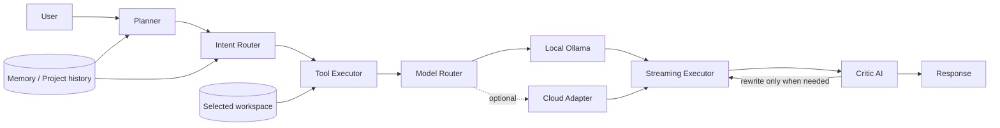
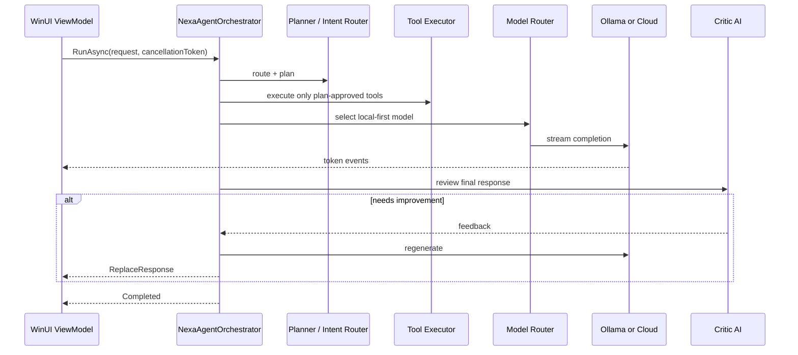

# Nexa.WinUI Architecture

`Nexa.WinUI` is a separate .NET 8 / WinUI 3 implementation. The existing Electron application remains unchanged.

## Directory structure

```text
nexa-winui/
  Nexa.Core/              # Testable .NET 8 domain/application library
  Domain/                 # Immutable records and enums only
  Application/            # Interfaces, planning, routing, critic, orchestration
  Infrastructure/         # Ollama, cloud adapter, tools, memory, repository, DI
  ViewModels/             # MVVM presentation state and commands
  MainPage.xaml           # Streaming chat UI
  tests/Nexa.WinUI.Tests/ # Unit tests with no Ollama dependency
```

## Data flow



## Sequence



## Extension points

All infrastructure dependencies are interfaces: `IPlanner`, `IIntentRouter`, `ITool`, `IModelClient`, `IModelRouter`, `ICriticAi`, `IMemoryStore`, `IProjectRepository`, `IAgentLog`, and `IAgentOrchestrator`.

To add a provider, implement `IModelClient` or `ITool` and register it in `Infrastructure/ServiceRegistration.cs`. No view model or domain class needs to change.

## Performance and security

- Local Ollama is the default route; cloud is selected only when `AllowCloud` is true and a server-side key is configured.
- Streaming uses `IAsyncEnumerable` and a channel, so UI updates do not block planning or cancellation.
- Chat mode grants no tools. Terminal execution requires both a non-chat mode and explicit `AllowTerminal`.
- File tools are scoped to the selected workspace; no arbitrary OS paths are accepted by the workflow.
- Project history and local memory are persisted under `%LocalAppData%\\Nexa`; replace the JSON adapters with SQLite/vector search without changing callers.
- Do not ship `NEXA_CLOUD_API_KEY` in a desktop installer. Keep it on a server-side proxy with authenticated quotas.
